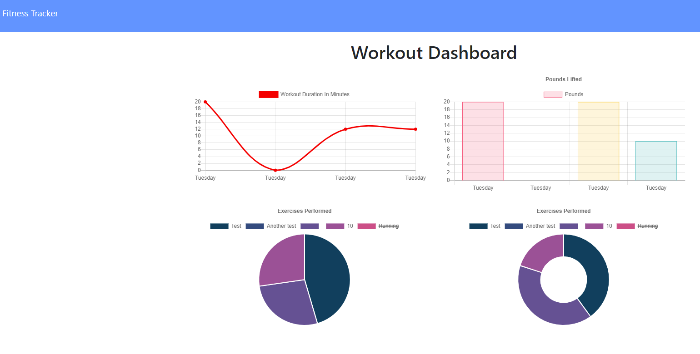

# Workout Tracker

## Table of Contents

1. [Description](#description)
2. [Installation](#installation)
3. [Usage](#usage)
4. [License](#license)
5. [Screenshot](#screenshot)

## Description:
Completed as a homework assignment for Trilogy's Fullstack Web Development Program through Washington University. The purpurpose of the application is to accumulate information from the user about their workout regiments and accumulate that data in ways that might be useful to them. The front end of the application was provided by Trilogy. The purpose of the assignment wasfor familiarizing the student with constructing a back end for an application using MongoDB.

## Usage:
[Click here](https://witnesser-of-fitnesser.herokuapp.com/) to access the application deployed on Heroku

## License: 
MIT

## Contributing: 
[Myrmoxenus](https://github.com/Myrmoxenus)

## Screenshot: 

